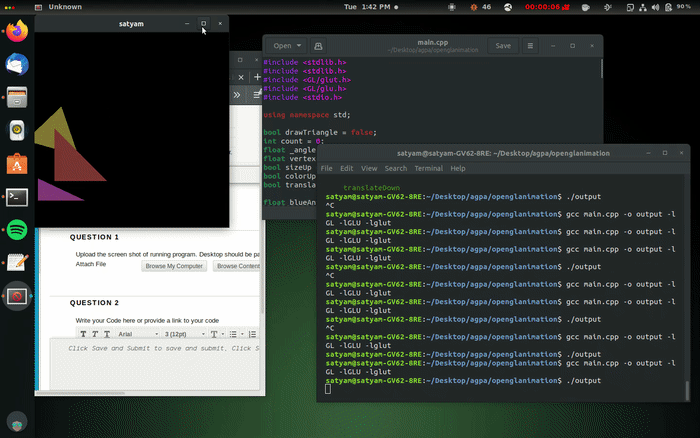

# opengl-triangle-animations
A simple OpenGL animation consisting of rotating, translating, changing colour and scaling a triangle up and down.

# What it looks like

# Code
[The main code](/main.cpp)
